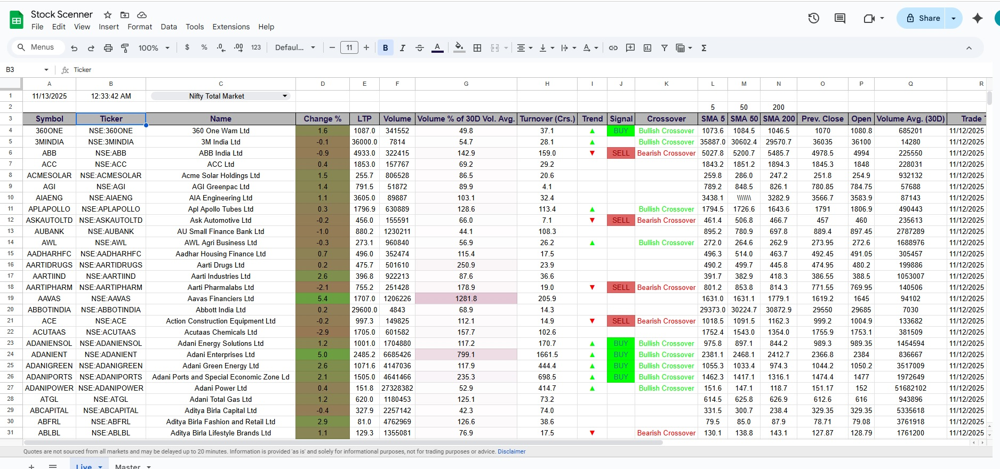

# 📈 Google Sheets Stock Screener – Live Market Dashboard

This project is a **Google Sheets–based Stock Screener** that tracks and analyzes **live Indian stock market data** (NSE-listed equities).  
It automatically fetches market prices, calculates technical indicators, and highlights **buy/sell signals** based on moving averages and trend logic.

---

## 🧠 Overview

The screener provides traders and analysts with an easy-to-read dashboard for identifying trading opportunities.  
All calculations and visual cues are built using **Google Sheets formulas, conditional formatting, and scripts**.

---

## ⚙️ Features

✅ **Live Market Data** – Auto-refreshes using Google Finance functions to fetch real-time quotes from NSE.  
✅ **Technical Indicators** – Calculates SMA (5, 50, 200), crossover signals, and trend direction.  
✅ **Buy/Sell Alerts** – Highlights bullish and bearish crossover points.  
✅ **Custom Dashboard View** – Filters stocks by index (Nifty 50, 100, 200, or Total Market).  
✅ **Color-Coded Visualization** – Green/Red formatting for instant signal recognition.  
✅ **Timestamp Tracking** – Records latest update date/time for reference.  
✅ **100% Google Sheets Based** – No external API or coding required — runs fully online.

---

## 📊 Columns Overview

| Column | Description |
|---------|--------------|
| **Symbol** | Stock symbol (e.g., NSE:INFY) |
| **Name** | Full company name |
| **Change %** | Daily price change percentage |
| **LTP** | Last Traded Price |
| **Volume** | Current trading volume |
| **Volume % of 30D Avg** | Relative volume strength |
| **Turnover (Cr.)** | Total traded value in crores |
| **Trend / Signal** | Derived BUY or SELL based on SMA crossovers |
| **SMA (5/50/200)** | Simple Moving Averages for trend confirmation |
| **Previous Close / Open** | Price reference points |
| **Volume Avg (30D)** | 30-day average volume for comparison |
| **Trade Date** | Last traded date |

---

## 🧮 Technical Logic

### **Trend Detection**
- **Bullish Crossover:** SMA(5) > SMA(50) and SMA(50) > SMA(200)  
- **Bearish Crossover:** SMA(5) < SMA(50) and SMA(50) < SMA(200)

### **Signal Generation**
- BUY → Bullish Crossover confirmed  
- SELL → Bearish Crossover confirmed  
- HOLD → Neutral conditions

---

## 📸 Dashboard Preview

---

## 🔗 View Live Project
You can open the live Google Sheet here 👇  
➡️ [**Open Stock Screener in Google Sheets**](https://docs.google.com/spreadsheets/d/e/2PACX-1vRUvFZFIXGyKxxXM_deIQYaMpOFo3o__8epLUblUfriIWCq4FtXPcGg9ssTgZh2-w4E-tnzxDzdWAjT/pubhtml?gid=0&single=true)  

> *(Make sure the Google Sheet is set to “Anyone with the link → View only”)*

---

## 🧩 Tools & Functions Used

- **Google Sheets**
- **GOOGLEFINANCE()** formula  
- **Conditional Formatting**  
- **Custom Formula Logic** for signals  
- **Data Validation & Dropdown Filters**

---

## 💼 Use Case
Ideal for:
- Retail traders tracking Indian equities  
- Data analysts building no-code stock dashboards  
- Educational demonstration of financial data handling

---

## 🧑‍💻 Author
**Divyen Solanki**  
📍 Vadodara, India  
💼 Product Analyst | Data Analytics | SaaS Implementation  
🔗 [LinkedIn Profile](https://www.linkedin.com/in/divyen-solanki-3a00a2bb/)  

https://docs.google.com/spreadsheets/d/e/2PACX-1vRUvFZFIXGyKxxXM_deIQYaMpOFo3o__8epLUblUfriIWCq4FtXPcGg9ssTgZh2-w4E-tnzxDzdWAjT/pubhtml?gid=0&single=true
